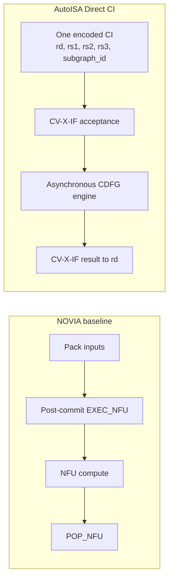
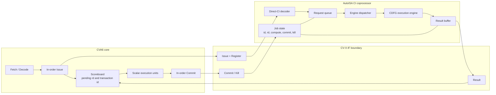
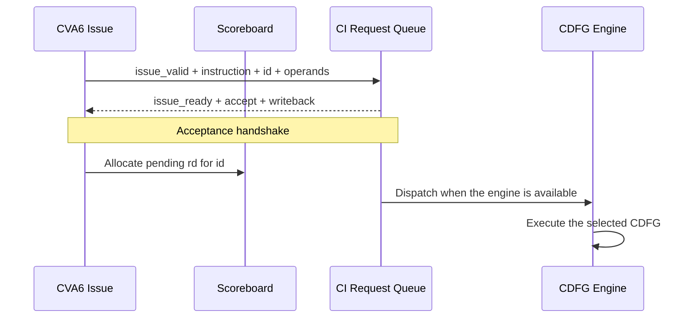
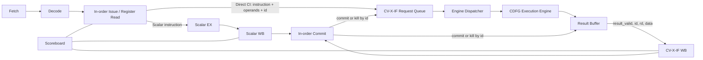
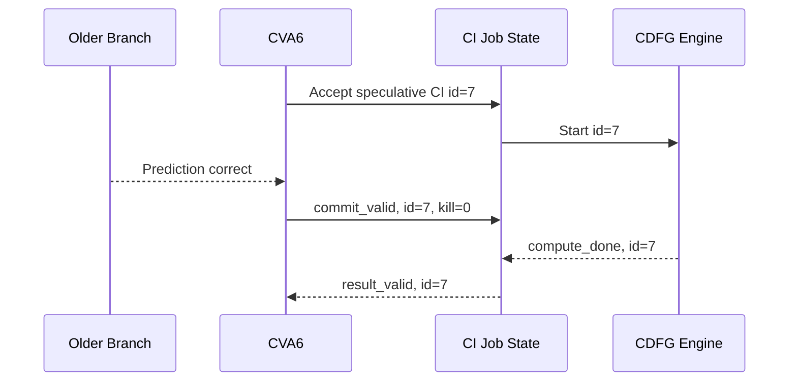
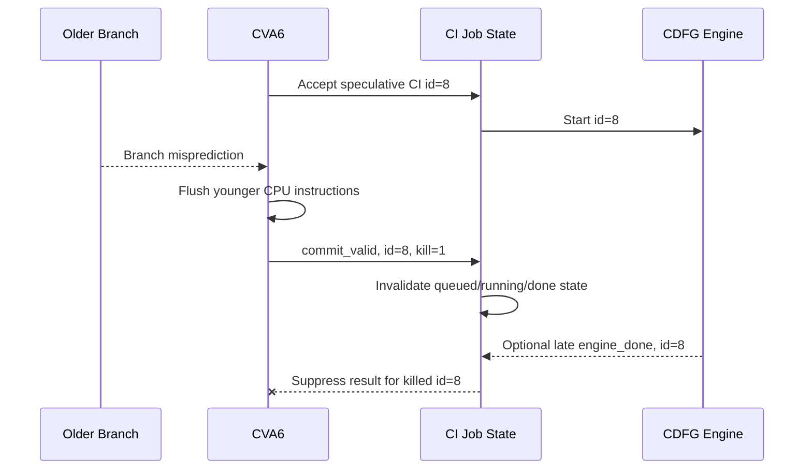

# AutoISA Direct-CI Integration Guide and Phase 1 Specification

> Target platform: CVA6 `cv32a65x` with an AutoISA CI coprocessor over CV-X-IF  
> Implementation repository: `T-TLedroid/cva6_UROP`  
> Reference revision: `master@10478bb21ffd068f434b3434814e4aa6ad095bfe`

## 1. Purpose

This document defines the custom-instruction integration mechanism expected by AutoISA and the implementation and verification requirements for Phase 1.

After reading it, you should be able to explain:

1. How AutoISA Direct CI differs from NOVIA's `pack -> execute -> pop` mechanism.
2. How one explicitly encoded instruction can represent a hardened CDFG subgraph.
3. How the CI coprocessor accepts a request before its CDFG execution engine finishes it.
4. Why independent scalar instructions may issue and execute while the CI is running.
5. Why an instruction that reads the CI destination register must wait.
6. How `commit_kill` removes a CI issued on a mispredicted path.
7. What must be implemented, measured, and demonstrated in Phase 1.

### 1.1 Canonical terminology

This document uses the following terms consistently:

| Term | Definition | Usage rule |
|---|---|---|
| **NOVIA NFU** | The NOVIA functional unit driven by `pack`, `EXEC_NFU`, and `POP_NFU`. | Use `NFU` only when describing the NOVIA baseline. |
| **AutoISA CI coprocessor** | The complete CV-X-IF-attached AutoISA block, including decode, request queue, job state, dispatcher, execution engine, result buffer, and commit/kill handling. | Use `CI coprocessor` for the complete AutoISA hardware block. |
| **CDFG execution engine** | The datapath inside the CI coprocessor that executes one selected hardened CDFG subgraph. | Use `execution engine` or `CDFG engine` for the internal compute resource. Do not call it an NFU. |
| **Engine dispatcher** | Internal control that sends a queued CI job to an available CDFG execution engine. | `Engine dispatch` is internal and is distinct from CV-X-IF request acceptance. |

The CI coprocessor and the CDFG execution engine are not synonyms. The engine is one component inside the coprocessor:

```text
CI coprocessor
  = decoder
  + request queue
  + job/commit/kill state
  + engine dispatcher
  + CDFG execution engine
  + result buffer
  + CV-X-IF interface control
```

---

## 2. Architectural Boundary: NOVIA Baseline vs. AutoISA Direct CI

### 2.1 NOVIA baseline

NOVIA uses several instructions to transfer values into and out of an NFU:

```text
pack inputs -> post-commit EXEC_NFU -> NFU computation -> POP_NFU
```

Its main properties are:

- `pack` transfers scalar values into an NFU input register file (IRF).
- `EXEC_NFU` starts hardware work after the instruction reaches commit.
- `POP_NFU` transfers an output from the NFU output register file back to a GPR.
- Starting after commit avoids speculative rollback inside the NFU.
- This mechanism remains useful as a baseline, but it is not the target AutoISA ISA contract.

### 2.2 AutoISA target

AutoISA uses one explicitly encoded instruction to invoke a hardened CDFG subgraph:

```assembly
ci.cdfg rd, rs1, rs2, rs3, subgraph_id
```

The fields have the following meaning:

- `subgraph_id`, encoded in opcode/funct/immediate bits, selects the hardened CDFG implementation.
- `rs1`, `rs2`, and `rs3` identify the live-in GPRs.
- Operand values are delivered through the CV-X-IF Register Interface.
- `rd` identifies the live-out GPR.
- The CI may start speculatively when it is issued.
- The result returns later through the CV-X-IF Result Interface.
- No `pack` or `pop` instructions are required.



### 2.3 Phase 1 operand boundary

Phase 1 supports three live-ins and one live-out:

\[
N_{live-in} \le 3, \qquad N_{live-out} \le 1
\]

This must eventually become a legality constraint in CDFG candidate extraction. A graph outside this boundary must be split, have its boundary changed, or use a future extended state-transfer mechanism. Phase 1 does not implement those alternatives.

---

## 3. Target Hardware Organization



### 3.1 Do not conflate acceptance, queue capacity, and engine availability

| Concept | Boundary | Meaning |
|---|---|---|
| `issue_ready` | CPU to CI coprocessor | The CI coprocessor can capture a new CI transaction. |
| Request queue full | Inside the CI coprocessor | No storage remains for another accepted CI. |
| `engine_busy` | Dispatcher to engine | The CDFG execution engine cannot start another job yet. |

The intended relationship is:

```systemverilog
issue_ready = request_queue_has_free_entry;
```

It must not be reduced to:

```systemverilog
issue_ready = !engine_busy;
```

An accepted CI may wait inside the CI coprocessor while its execution engine is busy. CPU-side backpressure is required only when the CI coprocessor has no capacity to capture the request.

Because CVA6 issues in order, a CI that remains at the CPU issue head due to `issue_ready=0` can also block younger scalar instructions. Internal buffering is therefore required to obtain the intended decoupling.

---

## 4. CI Acceptance over CV-X-IF

Consider:

```assembly
ci.cdfg x10, x1, x2, x3
```

The CI is accepted only on a clock edge for which all three conditions hold:

```systemverilog
issue_valid == 1'b1
issue_ready == 1'b1
issue_resp.accept == 1'b1
```

On that edge, the CI coprocessor must atomically capture the request:

```systemverilog
job.valid       <= 1'b1;
job.hartid      <= issue_req.hartid;
job.id          <= issue_req.id;
job.rd          <= decoded_rd;
job.subgraph_id <= decoded_subgraph_id;
job.rs1         <= register.rs[0];
job.rs2         <= register.rs[1];
job.rs3         <= register.rs[2];
```

The issue response declares which registers are read and whether the CI will write a destination:

```systemverilog
issue_resp.accept        = 1'b1;
issue_resp.writeback     = 1'b1;
issue_resp.register_read = sources_used_by_this_ci;
```

CVA6 can then allocate a scoreboard entry such as:

```text
transaction id = 7
destination    = x10
state          = pending
producer       = CV-X-IF
```

After the acceptance edge, the request must no longer depend on the CPU holding the issue signals. The CI coprocessor owns the saved transaction and is responsible for exactly one of these outcomes:

- return exactly one result after the CI is committed and completes; or
- return no result if the transaction is killed.



---

## 5. Asynchronous Execution and Scalar Overlap

### 5.1 Meaning of asynchronous execution

Asynchronous execution means that request acceptance and result delivery occur in different cycles and are correlated by `hartid + id`.

It does not imply:

- a separate clock domain;
- a software thread or interrupt;
- that the CPU stops tracking the instruction;
- unlimited execution past an unfinished CI.

### 5.2 Independent scalar instructions

```assembly
ci.cdfg x10, x1, x2, x3
add     x11, x4, x5       # independent
xor     x12, x6, x7       # independent
sub     x13, x8, x9       # independent
```

The scalar instructions do not read the pending `x10`. Subject to normal scoreboard capacity and other structural hazards, they may issue and execute while the CI engine is running.

```mermaid
gantt
    title CI execution overlapped by independent scalar work
    dateFormat X
    axisFormat %s
    section CI coprocessor
    CDFG execution       :active, ci, 0, 4
    Result available     :milestone, result, 4, 0
    section Scalar pipeline
    Independent ADD      :add, 1, 1
    Independent XOR      :xor, 2, 1
    Independent SUB      :sub, 3, 1
```



### 5.3 In-order retirement remains in force

CVA6 retires instructions in order. Younger scalar instructions may issue and execute before an older CI completes, but they normally cannot retire ahead of that CI:

```text
CI   : issued, running, not complete
ADD  : issued, execution complete, waiting to retire
XOR  : issued, execution complete, waiting to retire
```

Therefore, a commit-only trace is not sufficient to prove overlap. Verification must observe internal issue/execute events or dedicated event instrumentation.

An old unfinished CI can eventually block retirement and fill the scoreboard with younger completed instructions. The amount of latency that can be hidden is bounded:

\[
T_{hidden} \le \min(T_{independent\ work}, T_{scoreboard\ window})
\]

The expected property is bounded overlap, not unlimited CPU progress.

---

## 6. Dependent Consumers and Scoreboard Wakeup

Consider a direct RAW dependency:

```assembly
ci.cdfg x10, x1, x2, x3
add     x11, x10, x4
```

When the `add` reaches issue, the scoreboard reports that `x10` is pending from a CV-X-IF transaction. The `add` must not read the old architectural value and must remain blocked until the CI result becomes available.

The CI coprocessor eventually drives:

```systemverilog
result_valid  = 1'b1;
result.hartid = saved_hartid;
result.id     = saved_id;
result.rd     = saved_rd;
result.data   = computed_result;
result.we     = 1'b1;
```

The result is transferred only when:

```systemverilog
result_valid && result_ready
```

CVA6 uses the transaction ID to complete the corresponding scoreboard entry and make `x10` available. Depending on the forwarding/wakeup path, the consumer may issue in the transfer cycle or the following cycle, but never before the result is available.

```mermaid
sequenceDiagram
    participant I as CPU Issue
    participant S as Scoreboard
    participant N as CI Engine
    participant R as Result Interface

    I->>S: CI accepted; mark x10 pending
    I->>S: Attempt ADD that reads x10
    S-->>I: RAW hazard; wait
    N->>R: result_valid, id=7, rd=x10
    R-->>N: result_ready
    R->>S: Complete id=7; x10 is ready
    S-->>I: Dependent ADD may issue
```

### 6.1 Result backpressure

If `result_valid=1` and `result_ready=0`, the CI coprocessor must hold the valid bit and the entire result payload stable until transfer:

```systemverilog
assert property (
    result_valid && !result_ready
    |=> result_valid && $stable(result)
);
```

An incoming engine completion must not overwrite an older unconsumed result.

---

## 7. Pipeline Integration



The integration rules are:

1. A successful acceptance handshake removes the CI from the CPU/CV-X-IF request boundary.
2. The scoreboard marks the CI destination as pending.
3. Scalar instructions without relevant data or structural hazards may continue to issue and execute.
4. Background CI execution does not continuously occupy the issue handshake.
5. The result is matched by the original transaction ID, not only by `rd`.
6. In-order retirement remains unchanged.
7. Commit/kill controls whether speculative work may become architectural state.

---

## 8. Branch Misprediction and `commit_kill`

### 8.1 Two-phase rule

AutoISA uses:

```text
issue  -> speculative computation may start
commit -> architectural result is authorized
```

NOVIA instead uses `commit -> start computation`.

Each CI job must independently track:

```text
compute_done
commit_seen
killed
```

A result may be presented only when:

```systemverilog
result_valid = compute_done && commit_seen && !killed;
```

If computation finishes before commit, the result remains private in the CI coprocessor. This avoids having to undo a GPR write after a later branch misprediction.

### 8.2 Correctly predicted path



### 8.3 Mispredicted path



### 8.4 Kill behavior by job location

| Job location | Required behavior |
|---|---|
| Request queue | Remove the entry; do not dispatch it. |
| Running engine with abort | Abort the engine and release the job. |
| Running engine without abort | Mark it killed, allow it to drain, and discard completion. |
| Computation done, waiting for commit | Delete the buffered result. |
| `engine_done` and kill in the same cycle | Kill has priority. |

Phase 1 is compute-only, so no irreversible side effect occurs before result transfer. Accelerator stores are explicitly excluded. A future read-only prefetch path may discard its private data on kill, but stores must wait for commit or use a rollback-capable store buffer.

### 8.5 Job state machine

```mermaid
stateDiagram-v2
    [*] --> Free
    Free --> Queued: issue accepted
    Queued --> Running: engine dispatch
    Running --> DoneWaitingCommit: computation finishes first
    Queued --> CommittedQueued: commit arrives first
    Running --> CommittedRunning: commit arrives first
    CommittedQueued --> CommittedRunning: engine dispatch
    CommittedRunning --> ResultReady: computation finishes
    DoneWaitingCommit --> ResultReady: commit with kill=0
    ResultReady --> Free: result_valid and result_ready

    Queued --> Free: commit with kill=1
    Running --> Free: kill and abort
    Running --> DrainingKilled: kill; engine cannot abort
    DoneWaitingCommit --> Free: commit with kill=1
    DrainingKilled --> Free: engine completes; discard result
```



The current CV-X-IF example coprocessor does not fully consume the Commit Interface. Validate CI-coprocessor commit/kill behavior first with a module-level testbench that injects commit events. Full-core branch-misprediction validation requires a separate audit of how the current CVA6 integration generates `commit_kill`.

---

## 9. Phase 1 Scope: Compute-Only Direct-CI Substrate

Phase 1 must demonstrate all of the following:

1. A Direct CI uses explicit `rd/rs1/rs2/rs3/subgraph_id` encoding and no pack/pop instructions.
2. CV-X-IF accepts a CI into internal storage before engine completion.
3. Independent scalar instructions can issue/execute before the CI result returns.
4. A dependent consumer waits for the pending destination.
5. Result backpressure is handled without loss or overwrite.
6. Job state is tracked by `hartid + id`.
7. Queued, running, and completed jobs respond correctly to commit/kill.
8. Interface latency is measured separately from engine latency.

### 9.1 Out of scope

Do not implement the following in Phase 1:

- automatic arbitrary CDFG-to-RTL generation;
- compiler integration;
- internal loads, stores, datamovers, or streaming buffers;
- accelerator stores;
- multiple live-out registers;
- multiple parallel CDFG execution engines;
- full-workload speedup evaluation;
- broad CVA6 speculation-driver changes before module-level correctness is established.

---

## 10. Implementation Tasks

### Task 0: Freeze the baseline and preserve existing tests

Use:

```text
T-TLedroid/cva6_UROP
master@10478bb21ffd068f434b3434814e4aa6ad095bfe
```

Requirements:

- Preserve the existing `cus_mac` implementation and `cvxif_cycle_count` regression.
- Use new instruction encodings and test names for Direct CI.
- Do not use the existing 514/515-cycle MAC comparison as evidence of asynchronous scalar overlap.

Acceptance: all existing CV-X-IF tests still pass.

### Task 1: Add two Direct-CI operations

#### `cus_delay`

```assembly
cus_delay rd, rs1
```

Functional result:

```text
rd = rs1
```

Supported engine latencies:

```text
LATENCY = 1, 2, 4, 8, 16
```

This operation isolates protocol and scheduling behavior from datapath complexity.

#### `cus_cdfg_demo`

```assembly
cus_cdfg_demo rd, rs1, rs2, rs3
```

Suggested function:

\[
rd=((rs1\times rs2)+rs3)\oplus(rs1+rs3)
\]

This represents a small multi-node CDFG with parallel paths and a non-trivial critical path.

Acceptance: both operations match a software reference for at least 100 randomized input vectors.

### Task 2: Implement the request queue

Suggested file:

```text
core/cvxif_example/autoisa_ci_request_queue.sv
```

Use a parameterized queue with Phase 1 depth set to two:

```systemverilog
parameter int unsigned CI_QUEUE_DEPTH = 2;
```

Each entry must contain at least:

```systemverilog
valid, hartid, id, rd, we,
subgraph_id, rs1, rs2, rs3,
commit_seen, killed
```

Requirements:

- Drive `issue_ready` from available capture capacity.
- Accept a request while the engine is busy if queue capacity remains.
- Preserve payload stability and transaction order.
- Apply backpressure only when no request slot is available.

Acceptance:

- Two consecutive CIs can be accepted while capacity exists.
- Engine busy alone does not deassert `issue_ready`.
- Queue-full backpressure is stable and lossless.
- `issue_ready` recovers after an entry is released.
- IDs, destinations, and operands are neither dropped nor mixed.

### Task 3: Implement one asynchronous CDFG engine

Suggested file:

```text
core/cvxif_example/autoisa_ci_engine.sv
```

Minimum logical interface:

```text
job_valid / job_ready
job_id / job_operands / job_subgraph_id
done_valid / done_id / done_data
abort_valid / abort_id
```

Phase 1 contains one engine. While it is busy, the dispatcher does not start another job, but the request queue may continue to accept requests until capacity is exhausted.

Acceptance:

- Observed `cus_delay` engine latency matches its configured value.
- Queued jobs start in acceptance order.
- A new job cannot overwrite an active job.
- A killed running job is either aborted or explicitly drained and discarded.

### Task 4: Implement the result buffer

Suggested file:

```text
core/cvxif_example/autoisa_ci_result_buffer.sv
```

Requirements:

- Buffer at least one completed result.
- Hold all result fields stable under backpressure.
- Release the entry only after `result_valid && result_ready`.
- Return the original `hartid + id + rd`.
- Never overwrite an unconsumed result.

Required assertion:

```systemverilog
assert property (
    result_valid && !result_ready
    |=> result_valid && $stable(result)
);
```

### Task 5: Implement commit/kill tracking

Consume:

```text
cvxif_req_i.commit_valid
cvxif_req_i.commit.hartid
cvxif_req_i.commit.id
cvxif_req_i.commit.commit_kill
```

Required behavior:

```text
kill queued job     -> remove it
kill running job    -> abort or drain and discard
kill completed job  -> remove its buffered result
normal commit       -> authorize eventual result delivery
kill and done race  -> kill wins
```

Result gating must be equivalent to:

```systemverilog
result_valid = result_buffer.valid
            && result_buffer.compute_done
            && result_buffer.commit_seen
            && !result_buffer.killed;
```

Validate this task with module-level commit/kill injection. Full-core misprediction testing is a later integration gate.

### Task 6: Add event instrumentation

Record at least:

```text
ci_request_cycle
ci_accept_cycle
engine_dispatch_cycle
engine_done_cycle
commit_or_kill_cycle
result_valid_cycle
result_handshake_cycle
independent_scalar_issue_cycle
dependent_consumer_issue_cycle
```

Recommended CSV format:

```csv
event,cycle,hartid,id,rd,subgraph_id
ci_accept,100,0,7,10,0
engine_dispatch,101,0,7,10,0
scalar_issue,102,0,-,-,-
engine_done,108,0,7,10,0
result_handshake,109,0,7,10,0
dependent_issue,110,0,-,-,-
```

An `mcycle` total alone is not sufficient evidence of asynchronous overlap.

---

## 11. Verification Plan and Acceptance Criteria

### 11.1 Functional correctness

Run at least 100 randomized vectors for both `cus_delay` and `cus_cdfg_demo`.

PASS conditions:

- Every result matches the software reference.
- `id`, `rd`, `data`, and `we` correspond to the accepted request.
- No accepted committed job is lost or duplicated.

### 11.2 Independent overlap

```assembly
cus_delay x10, x1       # LATENCY = 8
add       x11, x2, x3
xor       x12, x4, x5
sub       x13, x6, x7
```

PASS: at least one independent scalar instruction issues or enters execution before the CI result handshake.

Do not require the younger instruction to commit ahead of the CI; CVA6 retains in-order retirement.

### 11.3 Immediate dependency

```assembly
cus_delay x10, x1
add       x11, x10, x2
```

PASS conditions:

- The dependent `add` does not issue before the CI result is available.
- It consumes the new CI result, not the previous value of `x10`.
- Same-cycle or next-cycle wakeup is allowed, depending on the forwarding path.

### 11.4 Distance-to-consumer sweep

```assembly
cus_delay x10, x1
K independent scalar instructions
add       x11, x10, x2
```

Sweep:

```text
LATENCY = 1, 2, 4, 8, 16
K       = 0, 1, 2, 4, 8, 16
```

PASS conditions:

- Consumer-visible stall generally decreases as independent distance increases.
- Results expose the scoreboard-window limit rather than assuming unlimited overlap.
- The report separates acceptance overhead, engine latency, result/wakeup overhead, and consumer-visible latency.

### 11.5 Queue-full backpressure

Issue multiple CIs targeting the single Phase 1 engine.

PASS conditions:

- Requests enter available queue/engine capacity.
- `issue_ready` deasserts only after all capture capacity is consumed.
- It recovers after capacity is released.
- No request is accidentally accepted while backpressured.

### 11.6 Result backpressure

At module level, force `result_ready=0` for 1, 2, 4, and 8 cycles.

PASS conditions:

- `result_valid` remains asserted.
- The entire result payload remains stable.
- Restoring `result_ready=1` produces exactly one transfer.

### 11.7 Commit/kill matrix

| Test | Stimulus | PASS condition |
|---|---|---|
| Kill queued | Kill after acceptance but before dispatch | No dispatch and no result. |
| Kill running | Kill while the engine is active | Abort or drain/discard; no result. |
| Kill completed | Kill after compute done but before result transfer | Buffered result is removed. |
| Normal commit | Commit with `kill=0` | Exactly one correct result is returned. |
| Done/kill race | `engine_done` and kill in the same cycle | Kill wins; no result. |

### 11.8 Regression

PASS conditions:

- Existing `cvxif_cycle_count` tests still run.
- Existing one-cycle custom operations retain their behavior.
- Existing `cus_mac` correctness does not regress.

---

## 12. Suggested Files and Deliverables

Suggested RTL files:

```text
core/cvxif_example/
  autoisa_ci_request_queue.sv
  autoisa_ci_engine.sv
  autoisa_ci_result_buffer.sv
```

Suggested tests:

```text
verif/tests/custom/cv_xif/
  autoisa_direct_ci_correctness.S
  autoisa_direct_ci_dependency.S
  autoisa_direct_ci_overlap.S
  autoisa_direct_ci_queue.S

verif/regress/
  autoisa_direct_ci.sh
  autoisa_direct_ci_unit.sh
```

Required documentation and result files:

```text
docs/
  autoisa_direct_ci_design.md
  autoisa_direct_ci_results.md

results/autoisa_direct_ci/
  events.csv
  latency.csv
  test_summary.tsv
```

Update whichever source manifest is actually used by the Verilator build, such as `Bender.yml`, a `.core` file, or another file list. Record the exact build entry point in the design document.

---

## 13. Phase 1 Completion Checklist

| Item | Required evidence |
|---|---|
| Direct encoding | One CI carries `rd/rs1/rs2/rs3/subgraph_id`; no pack/pop sequence. |
| Acceptance | A `valid && ready && accept` edge captures the complete job. |
| Queue semantics | Engine busy alone does not block acceptance; exhausted capacity does. |
| Asynchronous execution | An independent scalar instruction issues/executes before CI result transfer. |
| Dependency correctness | A consumer of pending `rd` waits for result availability. |
| In-order boundary | Results do not incorrectly claim younger instructions retire before the CI. |
| Result protocol | Result fields remain stable until `result_valid && result_ready`. |
| ID correctness | Request, result, commit, and kill use the same `hartid + id`. |
| Commit gate | Compute completion before commit does not cause architectural writeback. |
| Kill handling | Queued, running, and completed jobs can all be discarded safely. |
| Race handling | Kill has priority over same-cycle completion. |
| Measurement | Accept, dispatch, done, result, and consumer cycles are reported separately. |
| Functional testing | Randomized vectors match the software reference. |
| Regression | Existing CV-X-IF tests pass. |
| Reproducibility | One documented command runs unit and directed tests and produces the reports. |

Phase 1 is complete only when every checklist item has passing evidence.

---

## 14. Follow-On Work

After Phase 1 is complete, subsequent work may proceed in this order:

1. Audit and enable full-core `commit_kill` generation.
2. Validate rollback with a controlled branch-misprediction test.
3. Add multiple CDFG execution engines and per-engine dispatch.
4. Replace the demo datapath with CDFG subgraphs selected by AutoISA.
5. Synthesize interface/control and CDFG datapath separately for area and timing.
6. Add a read-only streaming/load path.
7. Feed measured latency, initiation interval, area, and queue capacity into the AutoISA performance model.

The purpose of Phase 1 is to establish a reusable and verifiable Direct-CI execution contract. Once that contract is stable, a legal CDFG datapath can replace `cus_cdfg_demo` without redesigning CPU/CV-X-IF control behavior.
